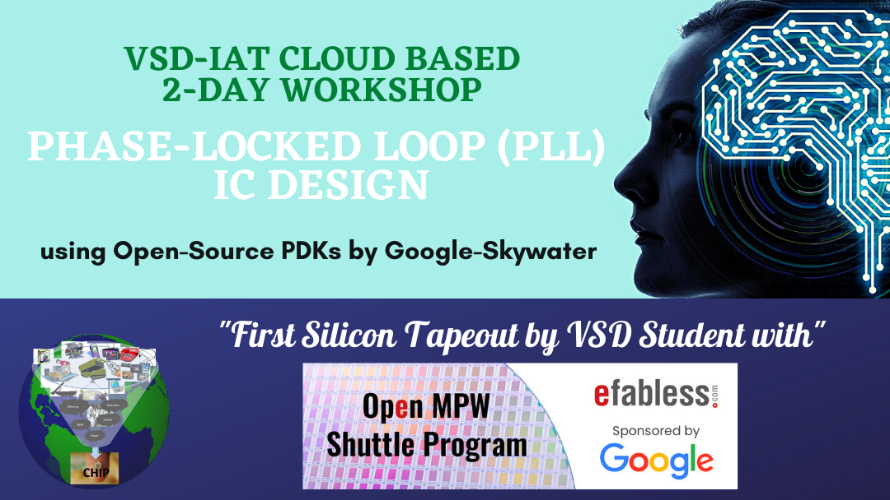

# Phase-Locked Loop IC design using Open-Source PDK

This repository reflects the work done in the PHASE-LOCKED LOOP (PLL) IC Design using Open-Source PDK workshop, offered by VLSI System Design Corp. Pvt. Ltd in collaboration with Lakshmi Sathi. It is a 2-day workshop that aims to give familiarity with open source tools, PDKs, Analog Design, and TapeOut Process under efabless.com. Furthermore, if you are a beginner, and visiting this GitHub repository, you can follow these steps to Design and Layout your own PLL IC.

## Taking the First Step
The beauty of open-source is that it is free and available to everyone. In the whole workshop, I have used only two tools and one PDK. Ngspice is an open-source mixed-signal electronic circuit simulator, used in circuit design, and pre-layout and post-layout simulation. Magic VLSI Layout Tool is an open-source circuit layout editor, used in circuit layout. Google SkyWater PDK is an open-source process design kit, used in physical design. To install these open-source tools, I would suggest you go to their websites:-
  1. [Ngspice](http://ngspice.sourceforge.net/)
  2. [Magic VLSI Layout Tool](http://opencircuitdesign.com/magic/)
  3. [Google/Skywater 130nm PDK](https://github.com/google/skywater-pdk)

It is recommended to use Linux-based OS over other kernel-based OS.

## Table of Contents
- [About](#about)
- [DAY 1: PLL Theory and Tools setup](#day-1--pll-theory-and-tools-setup)
  - [Introduction to PLL](#introduction-to-pll)
  - [Introduction to Phase Frequency Detector](#introduction-to-phase-frequency-detector)
  - [Introduction to Charge Pump](#introduction-to-charge-pump)
  - [Introduction to VCO and Frequency Divider](#introduction-to-vco-and-frequency-divider)
  - [Tool setup and design flow](#tool-setup-and-design-flow)
  - [Introduction to PDK, specifications and pre-layout circuits](#introduction-to-pdk,-specifications-and-pre-layout-circuits)
  - [Circuit design simulation tool - Ngspice Setup](#circuit-design-simulation-tool---ngspice-setup)
  - [Layout design tool - Magic Setup](#layout-design-tool--magic-setup)
- [DAY 2: PLL Design and post-layout simulations](#day-2--pll-design-and-post---layout-simulations)
  - [PLL components circuit design](#pll-components-circuit-design)
  - [PLL components circuit simulations](#pll-components-circuit-simulations)
  - [Steps to combine PLL sub-circuits and PLL full design simulation](#steps-to-combine-pll-sub---circuits-and-pll-full-design-simulation)
  - [Troubleshooting steps](#troubleshooting-steps)
  - [Layout design](#layout-design)
  - [Layout Walkthrough](#layout-walkthrough)
  - [Parasitics extraction](#parasitics-extraction)
  - [Post Layout simulations](#post-layout-simulations)
  - [Steps to combine layouts](#steps-to-combine-layouts)
  - [Tapeout theory](#tapeout-theory)
  - [Tapeout labs](#tapeout-labs)
- [Future Scope](#future-scope)
- [Extra Reference Material](#extra-reference-material)
- [Acknowledgements](#acknowledgements)

## *****************************************************************************

## About
This workshop presents a basic overview of Phase-Locked Loop IC design using Open-Source Google-Skywater 130nm node, using an intuitive approach to designing a simple PLL with little math and without diving into complex frequency domain analysis and control system theory. Starting with basic PLL concepts, this overview spans all the steps in the IC design flow - circuit design, simulation, layout, parasitics extraction, post layout simulation and finally, it also briefly includes the use of the latest caravel harness to make tapeouts.

## DAY 1: PLL Theory and Tools setup

THis repo is under Construction. Sorry for the inconvience.
